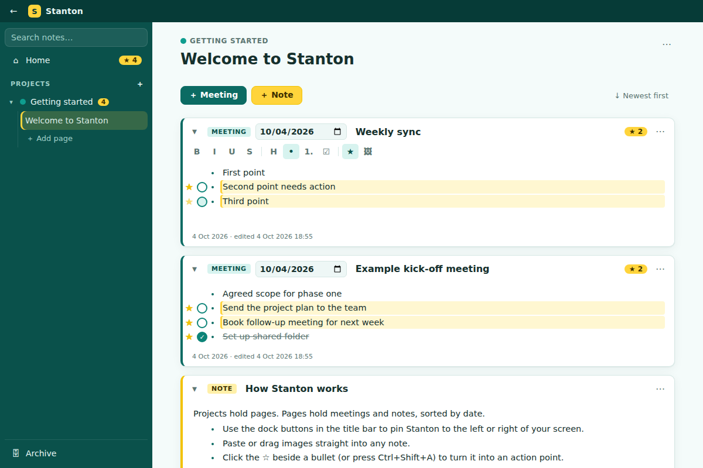
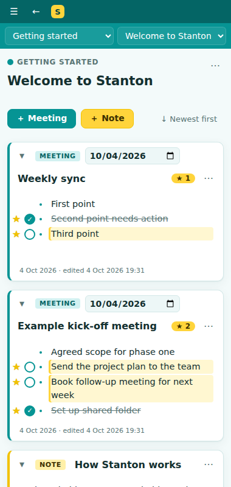

# Stanton

A lightweight meeting-notes app for Windows. It works like OneNote without the extra weight, and you can dock it to the side of your screen.

 

## Features

- **Projects → Pages → Meetings & Notes.** Each page lists its meetings and notes by date, newest or oldest first. A meeting's title has its date in front of it.
- **Action points.** Click the ☆ to the left of any bullet, or press `Ctrl+Shift+A`, to star it as an action point.
  - Open action points are pinned to the top of their **project**.
  - The **Home** page collects open action points from every project, grouped by project or as one list.
  - Tick the circle to mark an action point done (`Ctrl+Shift+D` inside the editor). It drops off the pinned lists but stays in the original meeting, struck through. "Recently completed" on Home lets you undo.
  - Click an action point to jump to the meeting it came from.
- **Rich notes.** Bold, italic, underline, headings, bullet and numbered lists, checklists and links. You can paste or drag in images and resize them. Pasted HTML from web pages and Office keeps its formatting.
- **Dock to the screen edge.** Use the ⇤ / ⇥ buttons in the title bar. On Windows, Stanton registers as a shell *AppBar* (the same mechanism the taskbar uses), so maximised windows fit beside it. Drag its inner edge to resize it. In the narrow docked layout, the project and page drop-downs and the ☰ drawer let you move between projects and pages.
- **Archive or delete** projects and pages from their ⋯ menus. Archived items are listed under **Archive**, where you can restore them.
- **Search** across page titles and note text (`Ctrl+F`).
- Teal and yellow theme, with automatic light and dark modes.

## Data

Everything is stored locally under `%APPDATA%\Stanton\data\`:

- `stanton.json` holds all projects, pages and entries. It is written atomically, and the previous version is kept as `stanton.json.bak`.
- `images\` holds pasted and inserted images.

## Development

Requires Node.js 20+.

```bash
npm install
npm run dev        # Vite dev server + Electron with live reload of the UI
npm test           # unit tests
npm run typecheck
```

## Releases

Push a version tag and GitHub Actions builds Stanton on Windows and publishes a GitHub Release
with an installer, a portable `.exe` and a `.zip`:

```bash
npm version patch            # bumps package.json and creates a tag such as v0.1.1
git push --follow-tags
```

You can also run the **Release** workflow by hand from the Actions tab. With *publish* ticked, it creates the tag `v<package.json version>` and the release. Without it, the build is only uploaded as a workflow artifact.

## Building a Windows installer locally

Run this on Windows:

```bash
npm install
npm run dist       # → release/Stanton-Setup-x.y.z.exe, a portable .exe and a .zip
```

To cross-build from Linux or macOS, first install the Windows build of the FFI library that the dock uses:
`npm install --no-save --force @koromix/koffi-win32-x64`.

## Project layout

```
electron/        main process: window, storage, image protocol, AppBar docking
  appbar.ts      SHAppBarMessage via koffi (falls back to edge-snapping elsewhere)
src/             React renderer
  editor/        TipTap editor + action-point extension (stars on list items)
  components/    Home, Project, Page, Archive views, sidebar, title bar, dialogs
  lib/           action-point extraction, persistence bridge, helpers
  store.ts       zustand store and debounced persistence
```

Action points are not stored separately. They are list items in an entry's document with `action` (`open` / `done`) and `actionId` attributes. The Home and project views derive their lists from those, so the pinned copies always match the meeting.
